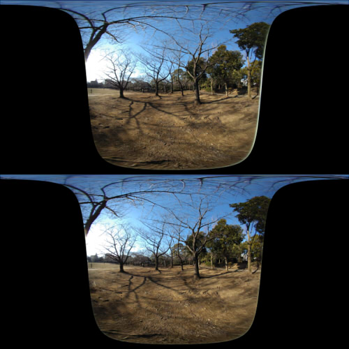
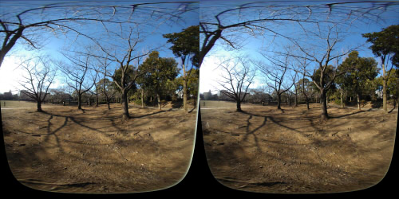
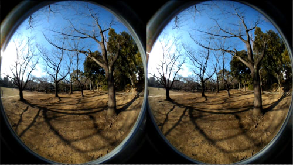
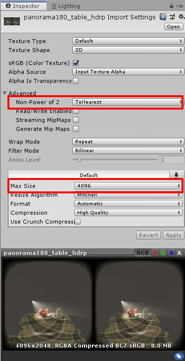
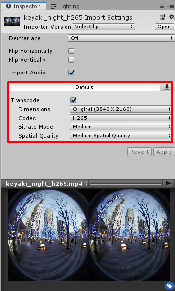

# Unity_Panorama180View
Translated with Google Translate.    

[To Japanese document](README_jp.md)    

A sample project for viewing still image of Equirectangular 180 degrees Side By Side or VR180 video of fisheye as VR on Unity.    
For VR180 still image, please convert them to 2 eyes layout in advance with "VR180 Creator" (https://vr.google.com/vr180/apps/).    

## Development environment

Unity 2018.3.8 (Windows)     
Updated to Unity 2019.1.9f1 (Windows)     

## Folder structure

    [Assets]    
      [Panorama180View]    Required files (copy and use)    
        [Panorama180View]
          [Resources]
            [Objects]
            [Shaders]
          [Scripts]
      [Images]             sample image
      [videos]             sample video (H.265)
      [Scripts]            Scripts used in sample      
      [Scenes]
        SampleScene        sample scene    
        StateTransition    Sample scene of state transition

## How to use

Please turn on "Virtual Reality Supported" in "XR Settings" of "Project Settings".    

1. Copy the "Panorama180View" folder to the project.    
2. Added "Scripts/Panorama180View/Panorama180View" to the MainCamera component.    
3. In the Inspector of MainCamera, specify the parameter of "Panorama180View".    

| Parameter name| Description |
| :--- | :--- |
|File Type|Image or Video |
|Image|Still image|
|Video|Video Clip|
|ProjectionType|Equirectangular360TopAndBottom : Place left eye / right eye equirectangular 360 degrees image on the top and bottom Equirectangular180SideBySide : Place left eye / right eye equirectangular 180 degrees image on the left and right FishEye180SideBySide : Place left eye / right eye fish eye 180 degrees image on the left and right |
|Radius|Background sphere radius|
|Intensity|Background brightness|

    

## Type of projection

### Equirectangular360 TopAndBottom

Place left eye / right eye equirectangular 360 degrees image on the top and bottom.    
    

### Equirectangular180 SideBySide

Place left eye / right eye equirectangular 180 degrees image on the left and right.    
    

### FishEye180 SideBySide

Place left eye / right eye fish eye 180 degrees image on the left and right.    
    

## Sample Scenes

| Scene name | Description |
| :--- | :--- |
| SampleScene | One that only displays panorama180 still image |
| StateTransition | Use a script to fade in and transition between two images |

## External method of Panorama180View.Panorama180View

By using the public method of Panorama180View.Panorama180View, script can control the state transition of panorama180.     
Please refer to "Assets/Scripts/StateTransition.cs" for usage.    

### Get version

     int GetVersion ();     

Get version.

### Change state transition 

     void SetStateTransition (StateTransitionType type);

Does not transition state with StateTransitionType.None.    
Fade in with StateTransitionType.FadeIn.   
Fade out with StateTransitionType.FadeOut.   
Blend two textures with StateTransitionType.Blend.   
When this method is called, it will transition to the specified state.    
Note that you can not change the value during transition.     

### Change transition source texture

    void SetSrcTexture (Texture2D tex);    

Specifies the texture of the transition source.    

### Change transition destination texture

    void SetDestTexture (Texture2D tex);    

Specifies the texture of the transition destination.    
In the case of "SetStateTransition(Panorama180View.Panorama180View.StateTransitionType.Blend);", transition from the texture specified in SetSrcTexture to the texture specified in SetDestTexture.    

### Change fade in color

    void SetFadeInColor (Color col);    
Specify the start color for fading in.     

### Change fade out color

    void SetFadeOutColor (Color col);    
Specify the end color for fading out.     

### Specify the state transition interval (seconds)

    void SetTransitionInterval (float interval);    
Specify the transition time in seconds.    

## Still image parameter

When importing a still image into a project, it is resized to a width of up to 2048 pixels by default.    
When displaying in VR using 180-degree panoramic images, resolution is coarse at 2048 pixels.    
This parameter may require at least 4096 pixels when used in VR.    
Change the parameters of this still image.    
Select the target image and display the Inspector window.     
    
"Max Size" can specify the size of power of 2 (up to 8192).    
If the original image size is not a power of 2, select "None" in "Non-Power of 2" to specify the original image size.    
In addition, moiré may occur when "Compression" is Normal Quality.    
In this case, select "High Quality".    
In particular, the quality may not be good with Normal Quality on Unity 2019.    
After changing the value, press the "Apply" button to confirm.    

## Video parameter

The video imports the mp4 file into the project.   
    
When the video is as large as 4K, the default condition is often that the playback is not stable.     
If the "Transcode" check box is turned on in the Inspector window and "Bitrate Mode" and "Spatial Quality" are Medium,    
the quality will be degraded, but playback will be more stable.    
Also, in case of Unity 2019, Codec of "H.265" can be specified.
H.265 is better with Bitrate at 1 frame than H.264.    
Also, as the file size can be reduced, it may be better to make the video file H.265 as much as possible.    

Video files can be converted using various formats and options by using ffmpeg ( https://ffmpeg.org/ ).    

## Change log

### [07/14/2019]

- Operation check with Unity 2019.1.9f1.
- Change "Texture compression" from Normal Quality to High Quality.
- Add H.265 Fish Eye Sample Video

### [05/02/2019]

- Added description of "Still image parameter" and "Video parameter"    

### [03/13/2019]

- Added methods of state transition with panorama180 still image.    
- Added sample scene "StateTransition".    

### [03/08/2019]

- First verion

