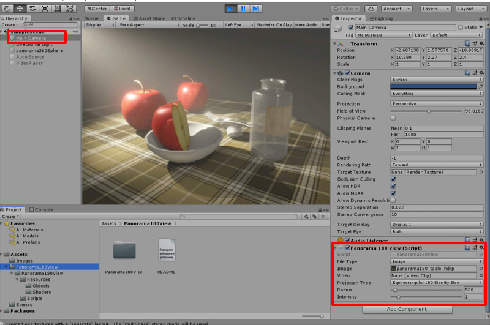
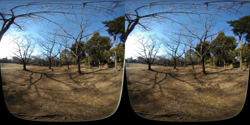

# Unity_Panorama180View

[英語ドキュメントへ](README.md)    

Equirectangular180のSide By Sideの静止画や
魚眼のVR180動画を、Unity上でVRとして見るためのサンプルプロジェクトです。    
静止画については、あらかじめ「VR180 Creator」 ( https://vr.google.com/vr180/apps/ )で2眼の配置に変換するようにしてください。    

## 開発環境

Unity 2018.3.7 (Windows)     

## フォルダ構成

    [Assets]    
      [Panorama180View]    必要なファイル（コピーして使用）    
        [Panorama180View]
          [Resources]
            [Objects]
            [Shaders]
          [Scripts]
      [Images]             サンプル画像
      [Scenes]
        SampleScene        サンプルシーン    

## 使い方

"Project Settings"の"XR Settings"で"Virtual Reality Supported"をOnにして使用してください。    

1. "Panorama180View"フォルダをプロジェクトにコピー。    
2. MainCameraのコンポーネントに"Scripts/Panorama180View/Panorama180View"を追加。    
3. MainCameraのInspectorで、"Panorama180View"のパラメータを指定。    

| パラメータ名| 内容 |
| :--- | :--- |
|File Type|Image(静止画像)/Video(動画)よりどちらか選択 |
|Image|静止画の場合のTexture|
|Video|動画の場合のVideo Clip|
|ProjectionType|Equirectangular360TopAndBottom : 上下に左目/右目のEquirectangular360度画像を配置 Equirectangular180SideBySide : 左右に左目/右目のEquirectangular180度画像を配置 FishEye180SideBySide : 左右に左目/右目の魚眼180度画像を配置 |
|Radius|背景球の半径|
|Intensity|明るさ|

    

## 投影の種類

### Equirectangular360 TopAndBottom

上下に左目/右目のEquirectangular360度画像を配置    
    

### Equirectangular180 SideBySide

左右に左目/右目のEquirectangular180度画像を配置。    
    

### FishEye180 SideBySide

左右に左目/右目の魚眼180度画像を配置。    
    

