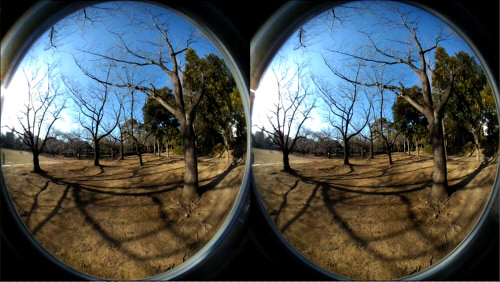
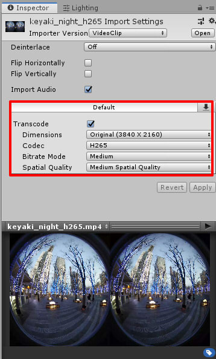

# Unity_Panorama180View

[英語ドキュメントへ](README.md)    

Equirectangular180のSide By Sideの静止画や
魚眼のVR180動画を、Unity上でVRとして見るためのサンプルプロジェクトです。    
静止画については、あらかじめ「VR180 Creator」 ( https://vr.google.com/vr180/apps/ )で2眼の配置に変換するようにしてください。    

## 開発環境

Unity 2018.3.8 (Windows)     
→ Unity 2019.1.9f1 (Windows)に更新。     

## フォルダ構成

    [Assets]    
      [Panorama180View]    必要なファイル（コピーして使用）    
        [Panorama180View]
          [Resources]
            [Objects]
            [Shaders]
          [Scripts]
      [Images]             サンプル画像
      [videos]             サンプル動画 (H.265)
      [Scripts]            サンプルで使用するスクリプト      
      [Scenes]
        SampleScene        サンプルシーン    
        StateTransition    状態遷移のサンプルシーン

## 使い方

"Project Settings"の"XR Settings"で"Virtual Reality Supported"をOnにして使用してください。    

1. "Panorama180View"フォルダをプロジェクトにコピー。    
2. MainCameraのコンポーネントに"Scripts/Panorama180View/Panorama180View"を追加。    
3. MainCameraのInspectorで、"Panorama180View"のパラメータを指定。    

| パラメータ名| 内容 |
| :--- | :--- |
|File Type|Image(静止画像)/Video(動画)よりどちらか選択 |
|Image|静止画の場合のTexture|
|Video|動画の場合のVideo Clip|
|ProjectionType|Equirectangular360TopAndBottom : 上下に左目/右目のEquirectangular360度画像を配置 Equirectangular180SideBySide : 左右に左目/右目のEquirectangular180度画像を配置 FishEye180SideBySide : 左右に左目/右目の魚眼180度画像を配置 |
|Radius|背景球の半径|
|Intensity|明るさ|

    

## 投影の種類

### Equirectangular360 TopAndBottom

上下に左目/右目のEquirectangular360度画像を配置    
    

### Equirectangular180 SideBySide

左右に左目/右目のEquirectangular180度画像を配置。    
    

### FishEye180 SideBySide

左右に左目/右目の魚眼180度画像を配置。    
    

## サンプルシーン

| シーン名 | 説明 |
| :--- | :--- |
| SampleScene | パノラマ180静止画を表示するだけのもの |
| StateTransition | スクリプトを使用して、フェードイン、2枚の画像の遷移を行う |

## Panorama180View.Panorama180Viewの外部メソッド

Panorama180View.Panorama180Viewのpublicなメソッドを使用することで、
スクリプトでパノラマ180の状態遷移を制御することができます。     
使い方は、"Assets/Scripts/StateTransition.cs"を参照してください。    

### バージョンを取得

     int GetVersion ();     

バージョンを取得。

### 状態遷移の変更

     void SetStateTransition (StateTransitionType type);

StateTransitionType.Noneで状態遷移しません。    
StateTransitionType.FadeInでフェードインします。   
StateTransitionType.FadeOutでフェードアウトします。   
StateTransitionType.Blendで2枚のテクスチャを合成します。   
このメソッドが呼ばれると、指定された状態に移行します。    
なお、遷移中は値を変更できません。     

### 遷移元のテクスチャの変更

    void SetSrcTexture (Texture2D tex);    

遷移元のテクスチャを指定します。    

### 遷移先のテクスチャの変更

    void SetDestTexture (Texture2D tex);    

遷移先のテクスチャを指定します。    
"SetStateTransition(Panorama180View.Panorama180View.StateTransitionType.Blend);"の場合に、    
SetSrcTextureで指定したテクスチャからSetDestTextureで指定したテクスチャに遷移します。    

### フェードインの色を変更

    void SetFadeInColor (Color col);    
フェードインする場合の開始色を指定します。     

### フェードアウトの色を変更

    void SetFadeOutColor (Color col);    
フェードアウトする場合の終了色を指定します。     

### 状態遷移の間隔（秒）を指定

    void SetTransitionInterval (float interval);    
遷移させるときの時間を秒単位で指定します。    

## 静止画像のパラメータ

プロジェクトに静止画像を読み込んだとき、デフォルトでは最大2048ピクセルの幅にリサイズされます。    
180度パノラマ画像を使用してVRで表示する場合は、2048ピクセルでは解像度が粗いです。    
最低4096はほしいところです。    
このときの静止画像のパラメータを変更します。    
対象画像を選択し、Inspectorウィンドウを表示します。     
    
「Max Size」で、2の累乗のサイズを指定できます（最大8192）。    
もしオリジナルの画像サイズが2の累乗でないときに、オリジナル画像サイズを保ちたい場合は「Non-Power of 2」で「None」を選択します。    
また、「Compression」がNormal Qualityの場合はモアレが発生する場合があります。    
このときは「High Quality」を選択するようにします。    
とくに、Unity 2019でNormal Qualityの場合は品質がよくない場合が多いかもしれません。    
値を変更した場合は「Apply」ボタンを押すと確定になります。    

## 動画のパラメータ

動画はmp4ファイルをプロジェクトに読み込みます。    
    
動画が4Kのように大きなサイズのとき、デフォルトの状態では再生が安定しない場合が多いです。     
このときのInspectorウィンドウで、「Transcode」チェックボックスをOnにし、    
「Bitrate Mode」と「Spatial Quality」をMediumにすると品質は劣化しますが、再生は安定しやすくなります。    
また、Unity 2019の場合は「H.265」のCodecを選択できます。   
H.265のほうがH.264よりも1フレームの転送効率（Bitrate）がいいです。    
また、ファイルサイズも小さくできるため、動画ファイルは可能な限りH.265にしたほうがいいかもしれません。    

動画ファイルはffmpeg( https://ffmpeg.org/ )を使用することで、様々なフォーマットやオプションを指定した変換を行うことができます。    

## 更新履歴

### [07/14/2019]

- Unity 2019.1.9f1で動作チェック
- テクスチャの圧縮を "Normal Quality"から"High Quality"に変更
- H.265のFish Eyeのサンプル動画を追加

### [05/02/2019]

- 「静止画像のパラメータ」「動画のパラメータ」の説明を追加    

### [03/13/2019]

- 静止画のパノラマ180で、状態遷移を行うメソッドを追加    
- "StateTransition"のサンプルシーンを追加    

### [03/08/2019]

- 最初のバージョン
